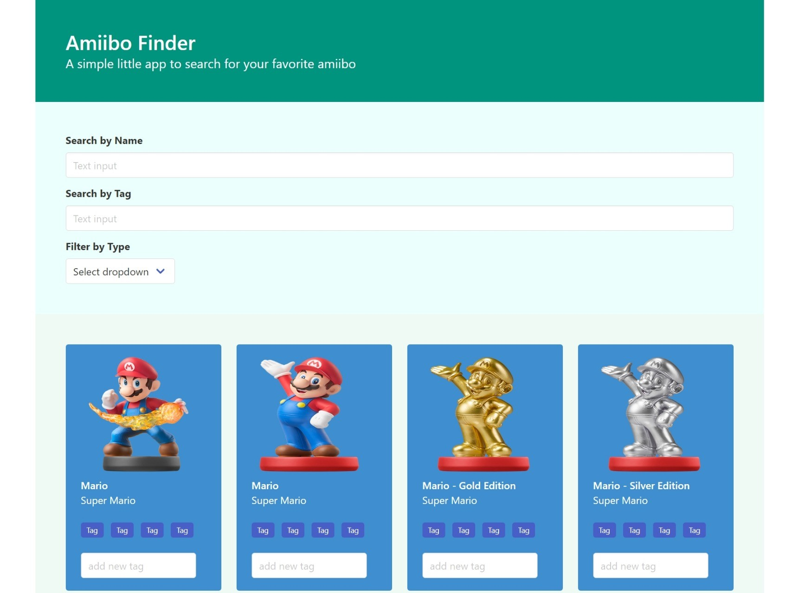

# Meridian Web Developer Assessment

This exercise is to evaluate how you as a junior web developer is trying to solve problems. We are interested to see how you organize the code and what the final results are including useful Git commit messages and comments where you think your code may be unclear.

Tasks are listed in order of complexity, and we don't expect you to complete all features in a limited amount of time. We look more for maintainability, readability and good organization of the code.


## Tasks
This is a simple one page application to find a specific Nintendo amiibo character. The basic structure of the application has been built to display a number of amiibos, and the task here is to complete the lookup and filtering part.
The code is partially completed and the user interface has some static data. The code can be adjusted or reorganized to suit your needs.



### Step 1
Implement the part of searching for characters by name.

### Step 2
Implement the part of filtering by type.

### Step 3
Implement the part of user-defined tags and the function of searching by tag.

### Other requirements
* Multiple filters can be applied at the same time and are AND related.
* Filtering can be done on the front-end or back-end depending on your preference.
* Tags are not required to be saved in the backend or frontend, and the user data is completely cleared after the page is refreshed.
* Styling will not be taken into consideration


## Environment
You can use any stable version of Node JS. Please use ESLint and Prettier or any other formatters for your code. 

## Dependencies
You can use either Yarn or NPM for dependency management. You can use any 3rd-party libraries as desired in order to achieve the tasks. 

## Commits
Try to make meaningful commit messages that show your progress while working on the project.

## How to run the backend & frontend

### API
```
cd api/
npm install
npm start
```

You can test the API is working by visiting http://localhost:3001/amiibo in the browser.

### Web application
```
cd frontend/
npm install
npm start
```

This will open your browser at http://localhost:3000, allowing you to test the React application.
